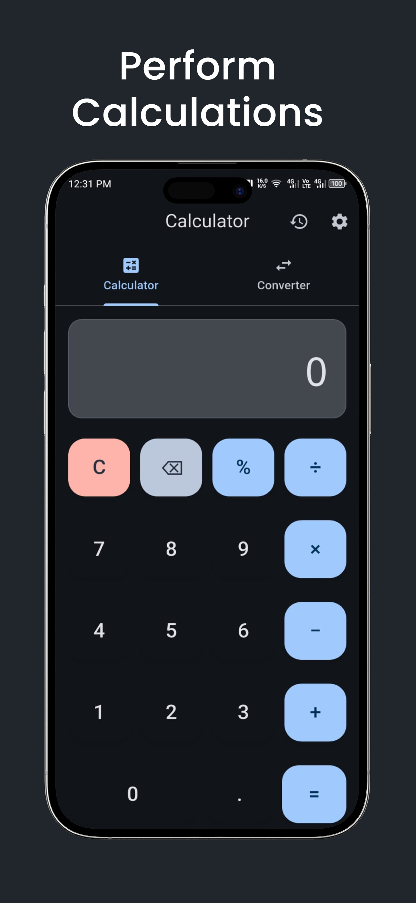
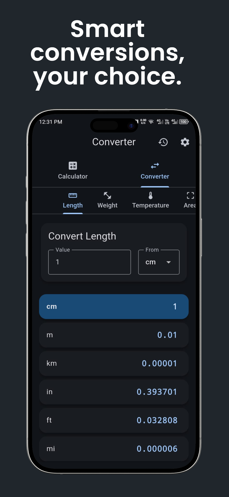
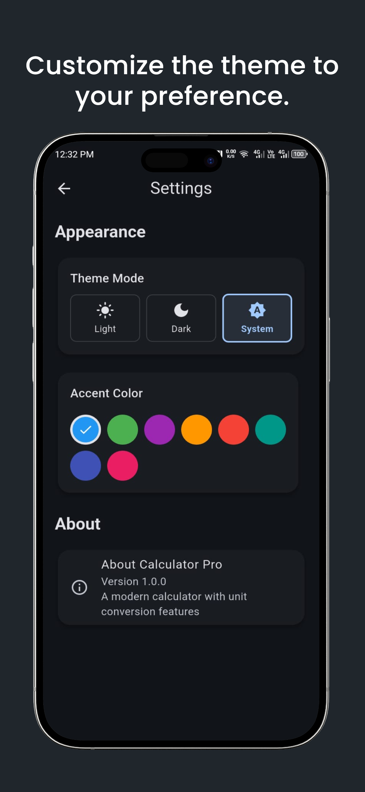

<div align="center">

# 🧮 Universal Calculator & Unit Converter

### A lightweight Flutter calculator and multi-category unit converter for study, work, and everyday use.

Built with **Flutter & Dart**.

</div>

---

## 📱 About the App

**Universal Calculator & Converter** combines a clean everyday calculator with a powerful unit conversion system in one lightweight mobile application.

It is designed for students, professionals, and everyday users who need quick calculations, convenient conversions, calculation history, and customizable appearance without unnecessary complexity.

---

## ✨ Features

### 🧮 Calculator

- Basic arithmetic operations
- Addition, subtraction, multiplication, and division
- Percentage calculations
- Decimal calculations
- Clean and responsive calculator interface

### 🔄 Unit Converter

Convert between commonly used units across multiple categories:

- 📏 **Length** — cm, m, km, ft, mile
- ⚖️ **Weight** — kg, g, lbs, oz
- 🌡️ **Temperature** — °C, °F, K
- 📐 **Area** — m², km², ft², acre, hectare
- 🚗 **Speed** — m/s, km/h, mph
- ⏱️ **Time** — seconds, minutes, hours, days
- 💾 **Digital Storage** — bytes, KB, MB, GB
- ⚡ **Energy** — Joules, Calories, kWh

### 🕘 Calculation History

Previous calculations are stored so users can quickly review earlier results without repeating calculations.

### 🎨 Custom Themes

Personalize the application with:

- Light mode
- Dark mode
- System theme
- Multiple accent colors

---

# 📸 App Preview

## Perform Everyday Calculations

<p align="center">
  
</p>

---

## Smart Unit Conversions

<p align="center">
  
</p>

---

## Theme Customization

<p align="center">
  
</p>

---

## 🛠️ Tech Stack

| Technology | Purpose |
|---|---|
| **Flutter** | Cross-platform application framework |
| **Dart** | Application logic |
| **Material Design** | User interface |
| **Local Storage** | Calculation history/preferences |

---

## 🚀 Run Locally

### Requirements

Make sure you have:

- Flutter SDK
- Dart SDK
- Android Studio or VS Code
- Android emulator or physical Android device

Clone the repository:

```bash
git clone https://github.com/Ahmadali-dev375/Calculator-App.git
